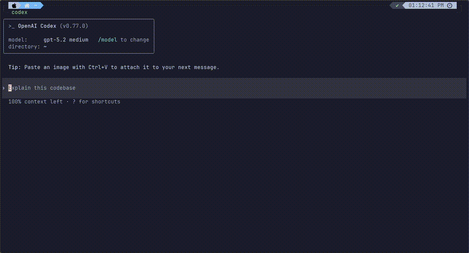

# QLMCP (Query Language Model Context Protocol)

**"수많은 MCP 서버, 이제 단 하나의 엔드포인트로 관리하세요."**

QLMCP는 파편화된 MCP 도구들을 하나로 묶어, AI가 자연어만으로 모든 기능을 찾아 쓰게 돕는 지능형 게이트웨이입니다.



## 🤔 왜 QLMCP인가요?

기존의 MCP 방식은 도구가 늘어날수록 사용자가 직접 관리해야 할 짐이 늘어납니다.

1. **번거로운 등록**: 새로운 기능을 쓸 때마다 매번 MCP 서버 주소를 찾고 설정 파일을 수정해야 합니다.

2. **복잡한 판단**: "이 질문엔 어떤 도구를 써야 하지?"를 사용자가 고민해야합니다.

3. **환경의 제약**: AI 서비스를 바꿀 때마다 공들여 쌓은 MCP 환경을 다시 세팅해야 합니다.

QLMCP는 이 모든 과정을 생략합니다.

단 하나의 주소만 등록하면, 나머지는 QLMCP가 알아서 처리합니다.

---

## ✨ 핵심 기능

### 1️⃣ 단일 도구 통합: `query`

더 이상 수십 개의 도구 이름을 외울 필요가 없습니다.

QLMCP는 모든 기능을 단 하나의 `query` 도구로 제공합니다.

사용자는 그저 무엇을 원하는지만 말하면 됩니다.

```JSON
// 사용자 요청
{
  "tool": "query",
  "args": {
    "query": "창원 맛집"
  }
}
```

```JSON
// Query 응답
{
  "status": "success",
  "data": {
    "상남동": "..."
  }
}
```

### 2️⃣ 지능형 자동 라우팅

사용자의 질문을 분석해 가장 적절한 MCP 서버와 도구를 **서버 측에서 자동으로 선택**합니다.

도구를 직접 고르는 번거로움이 사라집니다.

### 3️⃣ 토큰 및 컨텍스트 최적화

수많은 도구 명세서를 AI에게 보낼 필요가 없습니다.

QLMCP가 필요한 정보만 요약해서 전달하므로, AI의 답변 속도는 빨라지고 토큰 비용은 절감됩니다.

---

### ⚒️ 바로 사용 가능한 MCP 서버

QLMCP 하나로 아래 서비스들을 즉시 사용할 수 있습니다.

- [korea_weather_mcp](https://github.com/ohhan777/korea_weather): 한국 기상 정보

- [context7](https://github.com/upstash/context7): 개발 문서

- [naver-search-mcp](https://github.com/isnow890/naver-search-mcp): 네이버 검색

- Memory: PARA 기반 개인화 Memory

---

## 🚀 시작하기

> [!IMPORTANT] \
> 현재 안정적인 서비스를 위해 **GitHub 로그인** 인증을 권장합니다.

<details> <summary><b>Codex</b></summary>

```bash
codex mcp add qlmcp --url https://mcp.qlmcp.com/mcp
```

</details>